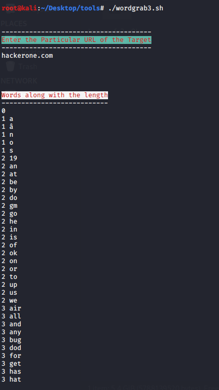
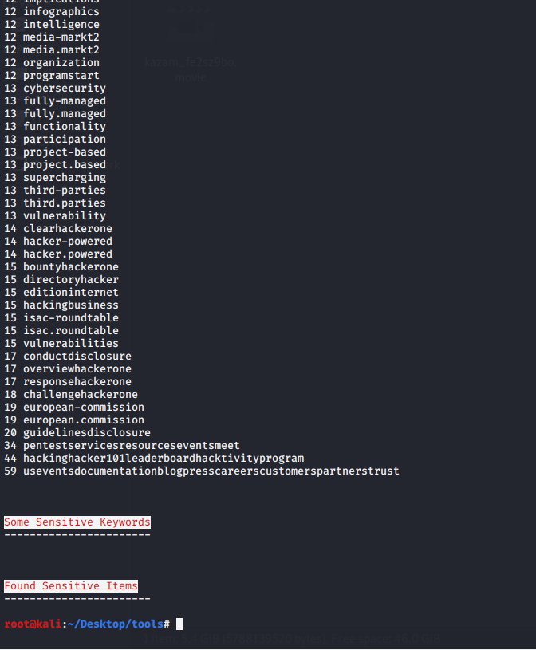

# FindSomething

After finding your target. Find some url of the target. Now you can test the URL with this script
---- Note: 3rd Image not in Hackerone

Reference:
----------
https://gist.github.com/gwen001/b0e97759d492d62bf40a33894f348937
